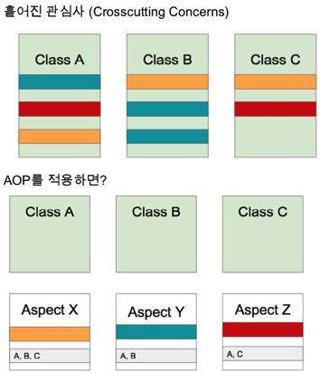
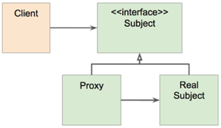

# 스프링 핵심기술 (3편)
 

# 스프링 AOP
Aspect-oriented Programming(AOP)는 OOP를 보완하는 수단으로,  
흩어진 Aspect를 모듈화 할 수 있는 프로그래밍 기법.  
 

 

## AOP 주요 개념
- Aspect(모듈) 
어드바이스와 포인트컷을 합친 개념. 
Aspect = Advice + Pointcut (해야할 일들을 어디에 적용?) 
- Target(적용 대상 클래스) 
- Advice(해야할 일들) 
- Join point(합류점) 
끼어들 수 있는 지점. 
메서드 실행 시점을 흔하게 사용. (메서드 실행할 때 Advice를 끼워넣어라.) 
생성자 호출 직전, 생성자 호출 했을 때, 필드에 접근하기 전, 필드에서 값을 가져갔을 때 등등 
- Pointcut(어디에 적용) 
Join point의 구체적인 sub set. 
'A라는 클래스의 b라는 메서드를 호출할 때 적용해라.' 

## AOP 구현체
- https://en.wikipedia.org/wiki/Aspect-oriented_programming  
- 자바에서는 AspectJ, 스프링 AOP  

## AOP 적용 방법
### 컴파일 타임 
자바 파일을 클래스 파일로 만들 때 바이트코드들을 조작. 조작이 된 바이트코드를 생성해냄. 
별도의 컴파일링이 더 필요. 
바이트코드를 조작하여 클래스로 만들어버리므로, 로드 타임과 런 타임 시 성능에 영향이 없음. 
### 로드 타임 
A라는 자바 파일이 있을 때, 컴파일은 순수하게 A클래스 그 자체로 컴파일. 
A클래스를 로딩하는 시점에 변경. 클래스 로딩 시점에 약간의 부하 발생.  
로드 타임 위버를 설정해야 함. (로드 타임 자바 에이전트를 설정해줘야 함.) 
AspectJ를 사용할 수 있으므로, 다양한 문법 사용 가능.  
A클래스의 바이트코드 자체는 변경이 없지만, 로딩한 JVM 메모리 상에서는 어드바이스가 같이 있는 상태로 로딩됨. 
> * 로드 타임 위빙: 로딩하는 클래스 정보를 변경하는 방법.

### 런 타임 
프록시 기반의 AOP. 스프링 AOP가 사용하는 방법.  
A라는 빈에 Aspect가 가진 어떠한 메소드(포인트컷)에 어드바이스를 적용해야 된다는 것을 스프링이 알고 있음.  
이미 클래스는 읽은 후 런타임 과정에서 A라는 타입의 빈을 만들 때, A라는 타입의 프록시 빈을 만듬.(A라는 빈을 감싼 프록시 빈을 만듬.)  
빈을 만들때만 초기 과정에 약간의 성능 부하.  
위에서의 컴파일 타임과 로드 타임과 같이 별도의 컴파일러나 자바 에이전트(로드 타임 위버)를 설정하지 않아도 되고,  
문법이 쉽고 AOP에 대해 많이 공부하지 않아도 된다.  

## 프록시 기반 AOP
### 스프링 AOP 특징
- 프록시 기반의 AOP 구현체  
- 스프링 빈에만 AOP를 적용할 수 있다.  
- 모든 AOP 기능을 제공하는 것이 목적이 아니라,  
스프링 IoC와 연동하여 엔터프라이즈 애플리케이션에서 가장 흔한 문제에 대한 해결책을 제공하는 것이 목적. 

### 프록시 패턴
기존 코드 변경 없이 접근 제어 또는 부가 기능 추가. 

 

#### ** 프록시 패턴을 구현해보자.
=> sombrero.aop.proxy_pattern 패키지 참조. 
그런데.. 
- 매번 프록시 클래스를 작성해야 하는가? 
- 여러 클래스 여러 메소드에 적용하려면? 
- 객체들 관계도 복잡하고.. 

### 그래서 등장한 것이 스프링 AOP
스프링 IoC 컨테이너가 제공하는 기반 시설과 Dynamic 프록시를 사용하여(같이 혼합해서) 여러 복잡한 문제 해결. 
#### * 동적 프록시
동적으로 프록시 객체를 생성하는 방법. 
**_동적으로(런타임 시) 어떤 객체의 프록시 객체를 런타임 때 만드는 방법._**  
자바가 제공하는 방법은 인터페이스 기반 프록시 생성 방법. 
CGlib은 클래스 기반 프록시도 지원. 
#### * 스프링 IoC
**_기존 빈을 대체하는 동적 프록시 빈을 만들어 등록 시켜준다._**  
클라이언트 코드 변경 없음. 
<pre>
AbstractAutoProxyCreator implements BeanPostProcessor
</pre>

> BeanPostProcessor: 어떤 빈이 등록되면 그 빈을 가공할 수 있는 라이프사이클 인터페이스. 

> 예를 들어 sombrero.aop.proxy_pattern.SimpleEventService가 빈으로 등록이 되면  
스프링이 AbstractAutoProxyCreator라는 BeanPostProcessor로  
SimpleEventService 빈을 감싸는 프록시 빈을 만들어서 그 프록시 빈을 SimpleEventService 빈 대신에 등록해준다. 

  

